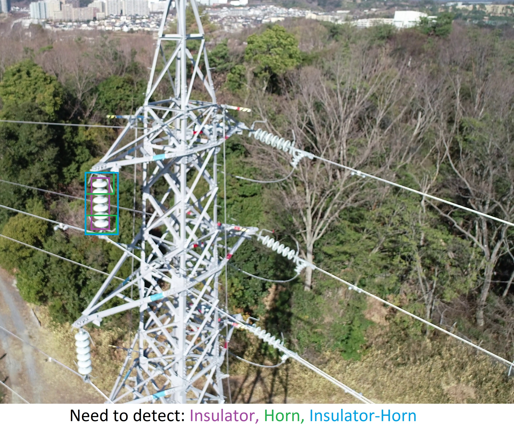
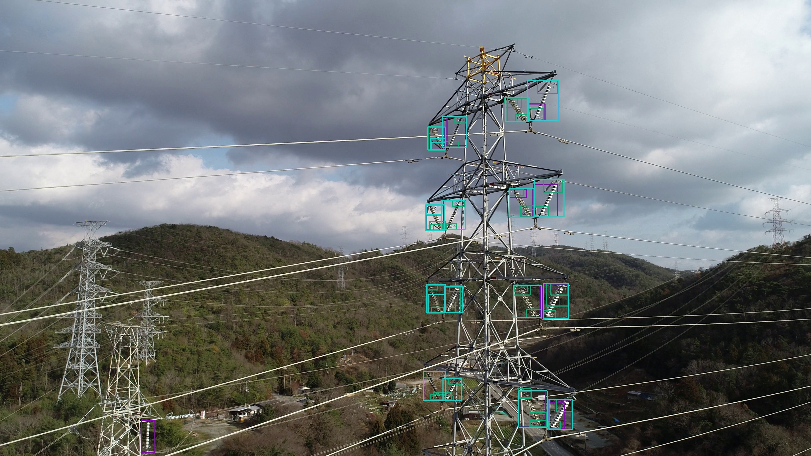
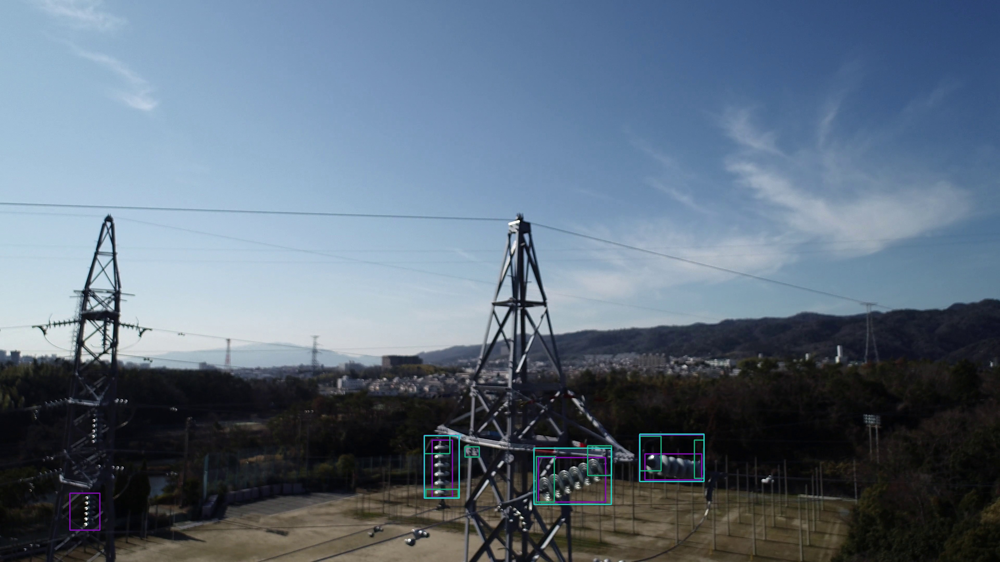

# Insulator-Horn Detection

This repo is created to describe the project `Terra Drone`, conducted from Oct. 2020 to Nov. 2020, between [CyberCore AI](https://cybercore.co.jp/) and [TerraDrone](https://www.terra-drone.net/global/)  
The code is belongs into CyberCore AI.
## Requirements  
Detect Insulator and Horn (image bellow)  

   

## Role
Team member of a team with 3 people. I mainly focus on modifying and training model, and doing Active Learning (read, present papers, and code from scratch) because no labeled data is provided.
## Results
The demo video is delivered to the customer.
### Visualization

  

  

  

